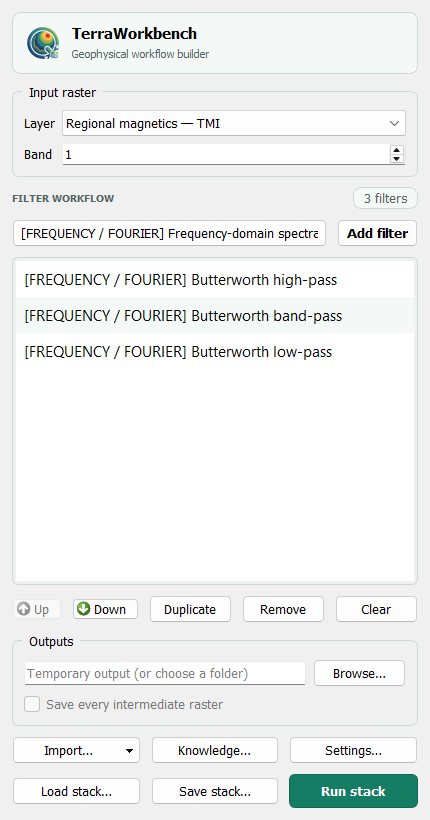

<div align="center">
  

  # TerraWorkbench

  **Open-source gravity and magnetic processing inside QGIS**

  Build repeatable survey workflows, chain FFT filters, correct magnetic field
  direction and run bounded 3D inversions without leaving the QGIS Processing
  ecosystem.

  [](#project-status)
  [](metadata.txt)
  [](https://qgis.org/)
  [](https://www.python.org/)
  [](LICENSE)
</div>

> [!IMPORTANT]
> TerraWorkbench is currently under **internal testing**. It has not yet been
> published in the official QGIS Plugin Repository. Interfaces, parameters and
> saved workflow formats may still change before the first public release.

<table>
  <tr>
    <td width="42%" align="center">
      
    </td>
    <td width="58%">
      <h3>One workbench, complete geophysical workflows</h3>
      <ul>
        <li><strong>67 native Processing algorithms</strong> for Model Designer and batch jobs</li>
        <li><strong>Dockable Filter Stack</strong> with reusable JSON recipes</li>
        <li><strong>RTP, RTE and IGRF-14</strong> magnetic field-direction tools</li>
        <li><strong>Survey import, gridding, leveling and microleveling</strong></li>
        <li><strong>Gravity, susceptibility, MVI and joint 3D inversion</strong></li>
        <li><strong>Auditable outputs</strong> in GeoTIFF, CSV, JSON, NPZ and VTK</li>
      </ul>
    </td>
  </tr>
</table>

TerraWorkbench is an independent community project. It is not an official
product of [QGIS](https://qgis.org/),
[Fatiando a Terra](https://www.fatiando.org/) or
[SimPEG](https://simpeg.xyz/).

## Workflow at a glance

```text
Survey grids / points / channels
              │
              ▼
 Import and metadata recovery ──► projected analysis-ready GeoTIFF
              │
              ▼
 Crossover QC and leveling ──► gridding ──► directional microleveling
              │
              ▼
 RTP / RTE / IGRF ──► sequential FFT Filter Stack ──► reusable recipe
              │
              ▼
 Gravity / susceptibility / MVI / joint inversion
              │
              ▼
 GeoTIFF + CSV residuals + JSON QC + NPZ + VTK models
```

## Capabilities

| Area | Included workflows |
| --- | --- |
| Magnetic enhancement | Horizontal and vertical derivatives, analytic signal, THDR, tilt, TDX, theta, directional gradients |
| Gravity enhancement | Derivatives, upward continuation, regional/residual separation, THDR, tilt and total gradient amplitude |
| Gravity reduction | GRS80 latitude field, gravity disturbance, free-air, Bullard B, simple/complete Bouguer, DEM terrain and Airy isostatic residual |
| Spectral processing | Butterworth, ideal, cosine roll-off, directional cosine, continuation and integration filters |
| Field corrections | RTP, RTE, general source-to-target transform and automatic IGRF-14 parameters |
| Survey preparation | GRD/GDAL/CSV/ASCII/FileGDB import, point gridding, crossover QC, tie-line leveling and microleveling |
| 3D inversion | Density contrast, scalar susceptibility, Cartesian MVI and joint gravity–magnetics cross-gradient inversion |
| Automation | QGIS Processing, batch mode, Model Designer and JSON Filter Stack recipes |

### Supported survey inputs

| Input | Support | Notes |
| --- | --- | --- |
| Oasis montaj `.GRD` | Native open-source read | Recovers CRS, title, dates and available XML metadata |
| GeoTIFF, GXF, AAIGrid and regular XYZ | GDAL | Converted to analysis-ready GeoTIFF |
| CSV / ASCII X-Y-value grids | Native | Requires a complete regular grid; irregular points are not silently interpolated |
| Survey point layers | Native | IDW or nearest-neighbor gridding to a projected raster |
| Esri FileGDB raster datasets | GDAL | Supports subdataset selection |
| Geosoft single-file `.gdb` | Standalone inventory and full export to open CSV/QGIS layers | Uses the Windows-only BSD GX Developer runtime; Oasis montaj is optional fallback only |

Original survey files are never modified. A Geosoft channel database is not an
Esri FileGDB. TerraWorkbench does not bundle Geosoft code: when the optional
bridge is used, it inventories or exports channels to open CSV and loads the
result into QGIS with recovered coordinate-system metadata.

<details>
<summary><strong>Magnetic and gravity exploration filters</strong></summary>

### Magnetic filters

- DX and DY first horizontal derivatives
- DZ first and DZ2 second vertical derivatives
- Configurable upward continuation and residual enhancement
- THDR total horizontal derivative and tilt angle
- Directional horizontal gradient with configurable azimuth
- AS / ASA analytic signal amplitude
- TDX horizontal tilt angle and theta angle map

### Gravity filters

- DX and DY first horizontal derivatives
- DZ first and DZ2 second vertical derivatives
- Configurable upward continuation
- Gaussian regional field and residual field
- THDR total horizontal derivative
- Tilt angle and total gradient amplitude

### Gravity corrections and anomalies

- GRS80 normal gravity and latitude-corrected gravity disturbance
- Linear free-air correction and free-air anomaly from observed gravity plus geometric elevation
- Infinite-plate Bouguer effect and simple Bouguer anomaly
- Bullard-B Earth-curvature correction for land elevations
- DEM rectangular-prism terrain correction with an explicit computation guard
- Complete land Bouguer anomaly: `observed - GRS80 + free-air - plate + terrain - Bullard B`
- Airy Moho-depth model and finite-prism isostatic residual anomaly

Observed gravity must already be calibrated and corrected for instrument drift and
Earth tides. Elevations must be geometric heights referenced to the ellipsoid and
aligned rasters must share the same CRS, extent and pixel grid. Terrain and Airy
forward modelling scale approximately with the square of the number of cells, so
the tools enforce a configurable safety limit and should use a defensible regional
resolution. The DEM/model extent is the outer correction boundary; inspect edges
and run density, depth and resolution sensitivity tests.

Canonical Processing IDs describe configurable operations:
`mag_directional_horizontal_gradient`, `mag_upward_continuation` and
`grav_upward_continuation`. Gradient azimuth and continuation distance are
configurable parameters and are not encoded as fixed values in their IDs.

</details>

<details>
<summary><strong>RTP, RTE and IGRF-14 magnetic transforms</strong></summary>

- Reduction to the pole with automatic IGRF-14 or manual field direction
- Reduction to the equator
- General source-to-target magnetic field-direction transform
- Survey date recovered from imported metadata with manual override
- Optional remanent magnetization direction
- Explicit maximum-gain stabilization cap

Automatic mode evaluates IGRF-14 at the raster center, survey date and
observation altitude using `ppigrf`. Inclination is positive downward and
declination is clockwise from geographic North. RTP and RTE can be
ill-conditioned at low magnetic latitudes, so stabilization and result review
are required.

The Filter Stack groups RTP, RTE and the general field-direction transform under
**MAG field-direction transforms**. These operations use a two-dimensional FFT:
the raster is transformed from map space into spatial-frequency/wavenumber space,
the transfer function is applied there, and an inverse FFT returns a spatial
GeoTIFF. "FFT" describes the numerical domain, not a different kind of output.

</details>

<details>
<summary><strong>FFT spectral processing and Filter Stack</strong></summary>

TerraWorkbench exposes the numerical domain instead of treating every grid
operation as the same kind of filter. Algorithm labels use:

- **SPATIAL / FINITE DIFFERENCE** for cell-neighbour derivatives such as the
  default DX and DY exploration products
- **FFT / HARMONICA** for Harmonica transformations executed in wavenumber space
- **FFT / MAGMAP-LIKE** for the explicit TerraWorkbench spectral engine
- **MIXED GRID / FFT** for products such as Tilt or analytic signal that combine
  spatial horizontal derivatives with an FFT vertical derivative
- **PHYSICAL CORRECTION / GRID** for Bouguer, terrain and gravity-reduction physics

The MAGMAP-like engine removes a mean or plane, reflect-pads the grid, applies a
cosine taper across only the padded margin, multiplies compatible transfer
operators on one forward 2D FFT, performs inverse transforms for requested
outputs, crops to the original footprint and optionally restores the trend.
Preprocessing parameters are stored with every stack recipe. This is deliberately
described as MAGMAP-like, not as a bit-for-bit reproduction of proprietary
MAGMAP preprocessing.

- Butterworth low-pass, high-pass, band-pass and notch
- FFT easting, northing and upward derivatives, orders 1–5
- Ideal band-pass and band-reject with an explicit ringing warning
- Cosine roll-off low-pass and high-pass
- Directional cosine pass and reject with configurable strike azimuth and degree
- Stabilized downward continuation with Butterworth taper and maximum-gain cap
- Horizontal integration in easting and northing, and vertical integration

The dockable Filter Stack feeds each output into the next filter. Steps can be
edited, reordered, duplicated and saved as JSON recipes. Results may remain
temporary or be written as a final GeoTIFF with every intermediate raster.

Wavelengths, continuation distances and pixel spacing use the raster CRS units.
FFT tools require an evenly spaced north-up raster in a projected CRS with no
NoData or non-finite cells.

</details>

<details>
<summary><strong>Line QC, gridding and microleveling</strong></summary>

**Crossover QC and tie-line leveling** operates on QGIS point layers. It builds
traverse and tie trajectories, interpolates measurements at crossings, rejects
robust MAD outliers and solves a zero-mean least-squares constant for each
connected line. Outputs preserve raw values and include corrected points,
crossover residuals, line corrections and RMS before/after.

**Survey point gridding** supports a projected output CRS, density-based or
explicit cell size, IDW or nearest-neighbor interpolation, neighbor limits and
search radius. A zero search radius fills the bounding rectangle; use a finite
radius to preserve unsupported gaps as NoData.

**Directional microleveling** estimates short across-line corrugation while
retaining longer along-line wavelengths. Both the corrected grid and removed
component are written for audit.

</details>

<details>
<summary><strong>Open-source 3D inversion</strong></summary>

TerraWorkbench provides bounded SimPEG workflows for:

- Gravity density-contrast inversion
- Magnetic scalar-susceptibility inversion
- Cartesian magnetic vector inversion (MVI)
- Joint gravity–magnetics inversion with adjustable cross-gradient coupling

Workflows accept projected observations, uncertainties, receiver elevation and
optional topography. They support uniform TensorMesh or observation/topography-
refined TreeMesh, Choclo integral kernels, disk-backed sensitivities, active-cell
limits and cancellation between iterations.

Outputs include VTK models, NPZ arrays, JSON QC and observed/predicted/residual
CSV tables. Inversion is non-unique: cell size, depth, uncertainties, bounds,
topography, inducing field and coupling weights must be tested rather than
treated as fixed interpretation.

</details>

## Scientific knowledge base

The dock includes a clickable **Knowledge** library with formulas, limitations
and canonical open-source repositories for users who want to read the original
documentation and code. The versioned
[TerraWorkbench Knowledge Base](docs/knowledge_base/README.md) also records
licenses, validation requirements and a gap-driven roadmap.

The **Settings / Configuración** button at the bottom of the dock switches the
complete TerraWorkbench interface and Processing catalogue between English,
Spanish and Portuguese without restarting QGIS. It also stores workflow defaults, result-loading
behaviour, scientific tooltips, the optional Geosoft location and direct access
to dependencies and bundled sample data. Developer: **Jordan Zavaleta (GisGeo
Dev)** — [jordanzav@gisgeo.dev](mailto:jordanzav@gisgeo.dev).

Reference code is studied and benchmarked; it is not treated as proof of parity
or copied without a separate license review.

## Bundled sample data

Use **Import… → Bundled sample datasets** to load a small synthetic magnetic
anomaly, gravity anomaly, aligned DEM or survey-like CSV flight lines. The
examples use EPSG:32718, declare their units and are released under CC0-1.0.
They are educational test values, not observations or geological evidence.

Locally copied third-party survey grids remain in the ignored
`sample_data/local_private/` directory and are never included in installation
or release packages unless their redistribution rights are established.

## Internal installation

Until an official QGIS release exists, clone the repository into any local
development folder:

```powershell
git clone https://github.com/jordan-zav/TerraWorkbench.git
cd TerraWorkbench
```

On Windows, verify automatic QGIS discovery without changing anything:

```bat
install_update_open_qgis.bat --check
```

Then install or update the plugin in the active QGIS profile:

```bat
install_update_open_qgis.bat
```

Use `--no-launch` to update the plugin without opening QGIS. Set `QGIS_ROOT`
only when automatic discovery cannot select the intended installation.

TerraWorkbench includes its own dependency manager, adapted from the GPLv3
[QPIP](https://github.com/opengisch/qpip) progress components. It reads
[`requirements.txt`](requirements.txt), checks versions and installs only after
explicit approval into the active QGIS profile. Each direct and transitive
package receives an individual status/progress row. It does not register QPIP as
a second plugin, patch QGIS plugin loading or manage dependencies for other
plugins. On the first activation of a newly installed version, this dependency
manager opens before the Filter Stack and Processing provider. If requirements
remain missing or conflicting, it opens again on the next activation. Restart
QGIS after installation or repair.

## Requirements

- QGIS 3.28 or newer
- Harmonica 0.7
- ppigrf 2.x
- SimPEG 0.25, discretize 0.12 and Choclo 0.3 for inversion workflows
- A projected, evenly spaced raster for FFT tools

The canonical [`requirements.txt`](requirements.txt) contains the complete 2D
and 3D runtime stack for the embedded manager. [`requirements-inversion.txt`](requirements-inversion.txt)
documents the inversion-only subset for manual environments.

## Development and verification

```powershell
python -m pytest -q
python -m ruff check .
python scripts/package_plugin.py --check-only
```

Run the real QGIS smoke tests through the QGIS Python launcher:

```powershell
$qgisRoot = & .\scripts\find_qgis.ps1
& "$qgisRoot\bin\python-qgis-ltr.bat" tests\qgis_smoke_test.py
& "$qgisRoot\bin\python-qgis-ltr.bat" tests\qgis_inversion_smoke.py
```

`build_dist.bat` asks for a version, validates source and metadata, and creates a
clean QGIS-installable ZIP from an explicit allowlist. Git data, tests, caches,
scripts and previous archives are excluded.

## Project status

Version **0.13.0** is an internal test build. The current verification baseline is:

- 28 unit/structure tests
- Ruff clean
- 67 algorithms loaded in QGIS 3.44
- Real Processing and multi-step Filter Stack smoke tests
- Gravity, susceptibility, MVI and joint TreeMesh inversion smoke tests
- Validated QGIS ZIP structure

Before the first public QGIS release, the project still needs clean-profile
dependency installation testing, official plugin validation and broader
scientific comparison against known reference grids.

## License and third-party software

TerraWorkbench is released under
[GPL-3.0-or-later](LICENSE). Runtime libraries remain separate projects under
their respective licenses; see [THIRD_PARTY_LICENSES.md](THIRD_PARTY_LICENSES.md).

Copyright © Jordan Zavaleta.
